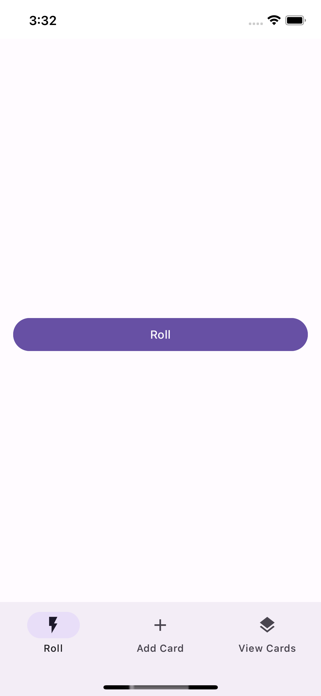
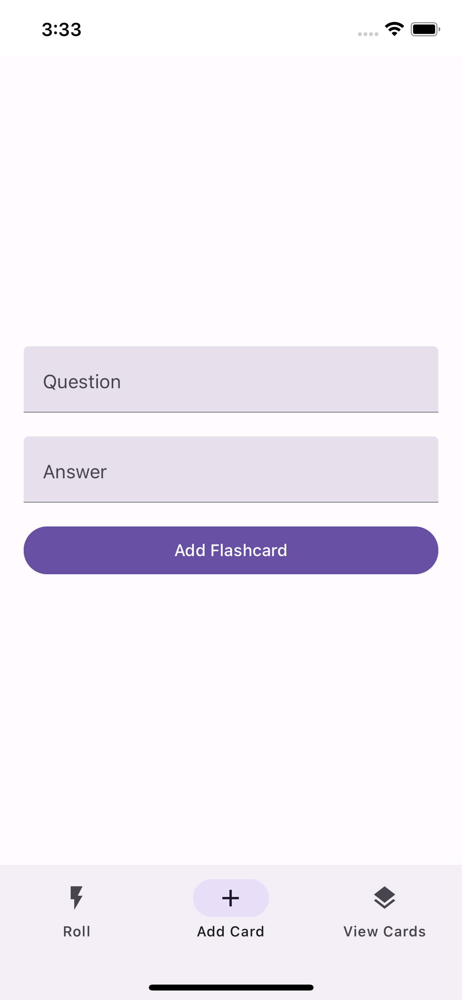

# Mental Roll

This is a simple flash card app in React Native. But instead of choosing how many flashcards you do it will will randomly choose how many to do for you, hence the `roll` part.

## Screenshots

<table>
  <tr>
    <td>
      
    </td>
    <td>
      
    </td>
    <td>
      
    </td>
    <td>
      
    </td>
  </tr>
</table>
